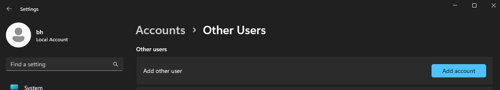
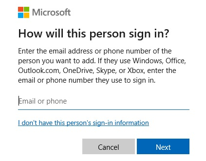

# Windows setup

>1. Creating a new user account
>2. Account setup

## New user account

>- press the `Windows` key and type settings on your keyboard

>- go to Accounts\Other Users\ and press `Add account`

>- click link `Add a user without a Microsoft account`

>- click link `I don't have this person's sign-in information.`

>- enter the account name (in the example it is `python_course`)
>- no password is required for the account - you can set it or not

---

## Account setup
Log in to the new account (in the example it is `python_course`) and:
 >- go back to settings
 >- go to the `System/For developers` tab
 >- activate the options shown in the pictures below:

