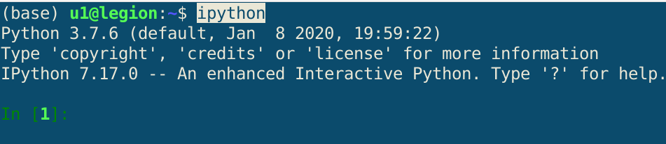
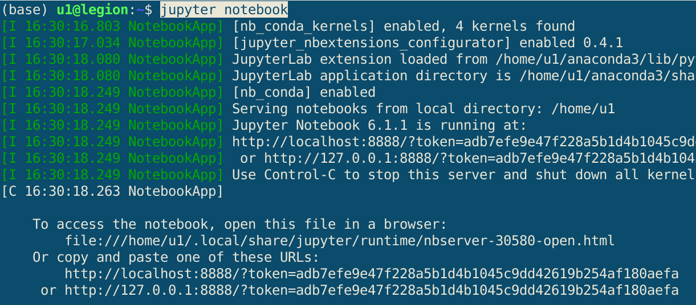

# 1. Programming tools 

Tools will be used for exercises:

  >- `ipython`: interactive Python interpreter console, see [here](https://ipython.org/ipython-doc/stable/overview.html)
  > - `Jupyter Notebook App`: in simple terms, an interactive console working in a web browser window, see [DataCamp tutorials](https://www.datacamp.com/community/tutorials/tutorial-jupyter-notebook)

# 2. `ipython` keyboard shortcuts

Start `ipython`:

  > in the system terminal (Linux) or in the Anaconda Prompt (Windows) write `ipython`.
 

### 2.1. Keyboard shortcuts:

  - `TAB` - completes and suggests syntax  
  - `name_object + ?` e.g. `myFunction?` display description (doc string) if available
  - `%hist / %hist n` - displays history of entered commands / with rows numbering
  - `ctrl + o` - put a new line behind the cursor
  - `ctrl + a` - moves the cursor to the beginning of the line
  - `ctrl + e` - moves the cursor to the end of the line
  - `ctrl + l` - cleans screen
  - `ctrl + c` - interrupts the current action
  - `ctrl + u` - deletes the entire text line

### 2.2. Saving (logging) a session

All work done in ipython can be saved to a text file using one of the magic functions:

>- %logstart
>- %history / %hist
>- %save

Example with `% hist`:

> `%hist -n -o -f path_to_my_history_file.txt`

### 2.3. Tutorial
> IPython documentation: [Tutorial](https://ipython.readthedocs.io/en/stable/interactive/index.html)

---

---

# 3. `Jupyter notebook`

Start `Jupyter notebook`:

  > in the system terminal (Linux) or in the Anaconda Prompt (Windows) write `Jupyter notebook`.
 

### Keyboard shortcuts:

  - `a` - inserts a cell above the active cell
  - `b` - inserts a cell below the active cell
  - `ctr + Enter` - run the code stored in the cell
  - `m` - changes the cell type to `Markdown`
  - `y` - changes the cell type to `Code`
  

---

---

# 4. Using `Python` modules

Generally speaking, python code is divided into parts called `modules`. The modules are text files with the `.py` extension . By default, only base modules are loaded. Using other modules, e.g. to perform scientific calculations, charts, etc. requires:

  - installing them on the system
  - each time loading modules into the computer’s memory called `import`.  

Because the modules are files saved on your computer, Python must „know” where to look for these files. By
default, Python searches the disk in the order:  

  - in current folder
  - in folder specified in the system variable `PYTHONPATH`
  - in folders given during `Python` installation
  - in folders secified in variable `sys.path`, which is oridinaly list. This path can be edited while the interpreter
is running, the path configuration is lost after ending interpreter.

Because we prefere apply the simplest solutions we will :  

  - created modules will be placed in the working directory
  - add a temporary path to `sys.path`

